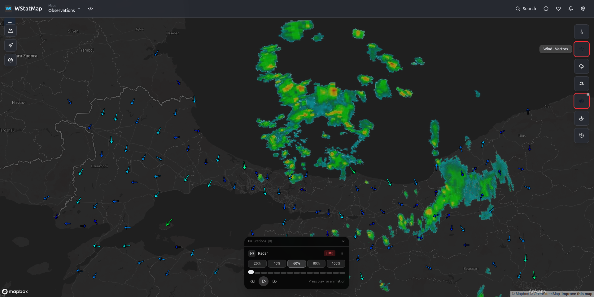

# Hi, I'm Sinan 👋

I'm an **Atmospheric Scientist** and a **PhD student at Istanbul Technical University (ITU)**.

My work focuses on atmospheric sciences, numerical weather prediction, data analysis & visualization, and scientific computing.

## 🌍 About Me

* 🎓 PhD Student at **Istanbul Technical University**
* 🌦️ Atmospheric Scientist
* 🌀 Specialized in **WRF (Weather Research and Forecasting Model)**
* 🌊 Experienced with **OpenDrift** for trajectory and dispersion modeling
* 🌱 Currently exploring and getting started with **Anemoi**
* 🗺️ Co-founder and contributor to **[WStatMap](https://wstatmap.com)** — a weather monitoring and analysis platform for exploring real-time meteorological observations, interactive weather maps, and numerical weather prediction data
* 📊 Interested in numerical weather prediction, atmospheric modeling, scientific data analysis, and visualization
* 📍 Based in Istanbul, Türkiye

